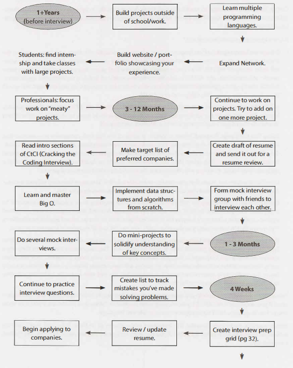
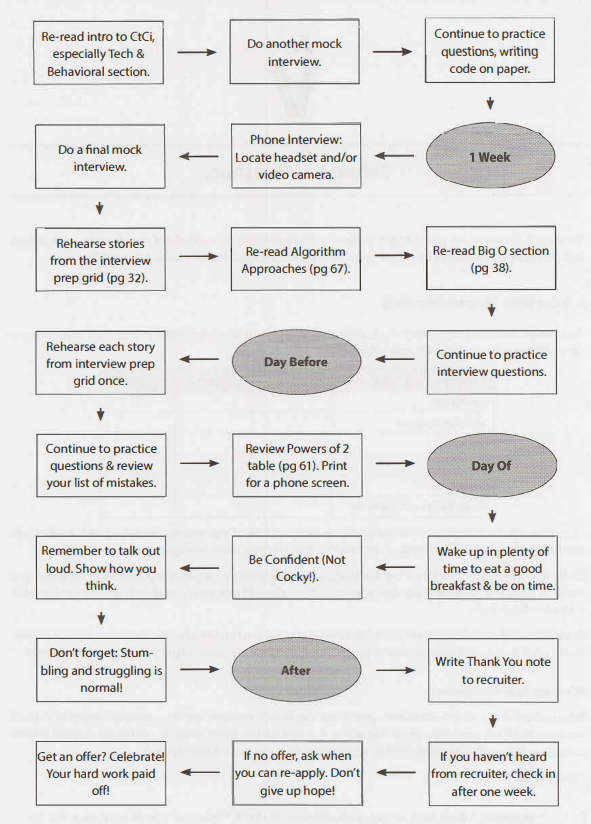
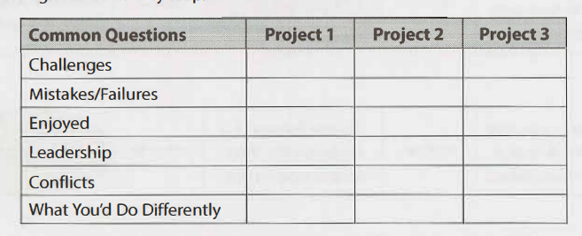

# Cracking The Coding Interview

## Chapters

- [Cracking The Coding Interview](#cracking-the-coding-interview)

  - [Chapters](#chapters)
  - [The Interview Process](#the-interview-process)
    - [How Questions are Selected](#how-questions-are-selected)
  - [Behind The Scenes](#behind-the-scenes)

    - [Microsoft Interview](#microsoft-interview)
      - [Definitely prepare](#definitely-prepare)
      - [What's Unique](#whats-unique)
    - [Amazon Interview](#amazon-interview)
      - [Prepare](#prepare)
      - [What's unique](#whats-unique-1)
    - [Google Interview](#google-interview)
      - [Prepare](#prepare-1)
      - [What's different](#whats-different)
    - 

  - [Chapters](#chapters)
  - [The Interview Process](#the-interview-process)

    - [How Questions are Selected](#how-questions-are-selected)

  - [Chapters](#chapters)
  - [The Interview Process](#the-interview-process)
    - [How Questions are Selected](#how-questions-are-selected)
    - [It's all relative](#its-all-relative)

- Chapter **1,2,3,4**,6,7,9,10

## The Interview Process

Interview performance is usually placed upon:

- Analytical Skills: Did you need much help solving the problem? How optimal was the solution? How long did it take? If you had to design / architect it, did you structure the problem well and think through trade offs?
- Coding Skills: Were you able to successfully translate your algorithm to reasonably code? Was it clean and well-organized? Did you think about potential errors? Did you use good styles?
- Technical knowledge / computer science fundamentals: Do you have strong fundamentals
- Experience: Have you made good technical decisions in the past? How are your projects? Have you shown drive, initative and other important factors?
- Culture fit / communication skills: Do your personality and values fit with the company and teams

- **Most interviews aren't alright with pseudocode for whiteboard interviews**

### How Questions are Selected

- Interviewers are usually given free reign on what questions to use "Questions at google" aren't going to give specifics as they can choose whatever question they want on a given day.
- Most of the qeustions they ask don't change over years
- Some companies focus on algorithms whilst others focus on knowledge based ones.

## Behind The Scenes

### Microsoft Interview

- MS wants smart people
- On the day you'll have a short interview with recruiter which will give you a sample question, prepping you not grilling you. Just easing you in before your "real interview" starts
- Be nice, they can be best advocate
- During the day you'll do 4-5 interviews w/ 2 different teams

#### Definitely prepare

- "Why do you want to work for microsoft"
  - I've been using MS products for a long time. I like how they've managed to create a cosnsitent environment on desktops that are universally excellent. I've been using VS recently to learn programming and it's XYZ is excellent

#### What's Unique

- You'll only reach the hiring manager if you've done well
- Microsoft gives team more individual controls since the product is diverse

### Amazon Interview

- Amazon starts with:
  - A phone screen for a specific team
  - If you have 2 or more they aren't convinced or being considered for a different team
  - After screens you fly to the office
    - 4-5 interviews with two teams based on interview
    - Code on a whiteboard & some interviewers will stress other skills
      - Recruiters will have a code on a whiteboard and some interviewers will stress other skills
    - The "bar raiser" interviewer is charged with keeping the bar high. They attend special training and will interview candidates outside the group. This guy is an expert in grilling.

#### Prepare

- Amazon cares about scale. Prepare about scalability. Don't need distributed system but check system design & scalability

#### What's unique

- Bar raiser is brought from a different team to keep the bar high. **need to improve bar raiser & hiring manager**

### Google Interview

- First phone interview
- Then google doc / whiteboard
- On site is 4-6 people will be a lunch interviewer
  - Interviewer feedback is confidential so you start at a blank slate
- Not focuses or no structure, just do whatever they like
- Written feedback is submitted to a hiring comittee (HC)
- To an extend an offer HC wants to see at least one "enthuastic endorser" i.e 3.6 vs all 3.1s
- You don't need to excell
- If you're recommended, your packet will go to a compensation offer and then management comittee

#### Prepare

- Cares about scalability
- Strong focus on analytical (algorithm) skills

#### What's different

- Hiring comitteee makes final decision. This is rarely rejected by google execs

### Apple Interview

- To do later

#### Facebook Interview

- To do later

#### Palantir Interview

- To do later

## Special Situations

### Startups

#### Application Process

- Remember to spend time doing planning on the algorithm before jumping into code

## Before the Interview

- Without a great resume there's no interview To improve your CV do this:
  - _Take The Big Project Classes_: Do a class with a big project, good group work / hackathon sized projects = good CV experience
  - _Do an internship_: Do everything you can to land an internship early in school. It will pave the way for good internships before you graduate
  - _Start something:_ Build a project in your own time, do a hackathon or open source project. Not only will this develop skills but it shows initative

  

## Behavioural Questions

- Go through each project and see if you can talk about it in detail
- List all major aspects including each project, job or actiity

### What are your weaknesses?

- When asked about weakness, give a real weakness
  - Answers like "I work too hard" tell recruiters you're arrogant and/or won't admit faults. A good example is:
  - "Sometimes, I don't have good attention to detail, whilst it's good cause it lets me execute quickly. It means sometimes I make mistakes. Because of that I make sure to always have someone double check my work"

### What Questions should you ask

**Genuine Questions**

1. "What are the ratio of developers to product managers? What is the interaction like? How does product planning happen on the team"
2. What brought you to this company. What's been most challenging to you

**Insightful Questions**

1. "I noticed you use technology X. How do you manage problem Y"
2. "Why did the product choose to use X over Y. I know it has benefits like A,B,C, but many companies choose not to use it because of problem D"

**Passion Questions**

1. I'm very interested in scalability, and I'd love more about this. What opportunities would there be to lern about this
2. I'm not familar with technology X, but it sounds interesting. Could you tell me more about it?

### Know your Tech Projects

- Choose 2-3 projects you deeply master and use the following critera:
  - Product had challenging components (beyond "learning a lot")
  - You played a central role (ideally on challenging concepts)
  - You can talk at technical depths
- For those projects, and all your projects be able to talk about the challenges, mistakes, technical decisions, choice of technology (and tradeoffs) and what you'd do differently

## Responding To Behavioural questions

### Be specific not arrogant

- Arrogance is a red flag, but you want to sound imprressive, to do this be specific
- Give the facts you did and let the interviewer derive an intreptation. Rather then saying you "did all the hard parts", instead describe what you did and how you found that challenging

### Limit Details

- Don't balabber around a project as people get lost in etails
- Stay light on details, giving key points. When possible translate it or explain the impact. Can always offer the opportunity to drill further

"By examining the most common user behavior and applying the Rabin-Karp algorithm, I
designed a new algorithm to reduce search from O(n) to 0( log n) in 90% of cases. I can go
into more details if you'd like:'

### Focus on yourself not the team

- Most people (especially in leadership roles) use "we" "us" "them". Interviewers walk away thinking you did nothing
- Pay attention to your answers and listen for how much you say "we" vs "I". Assume every question about your role, and speak to that

page 45 ### Give Structured Answers
